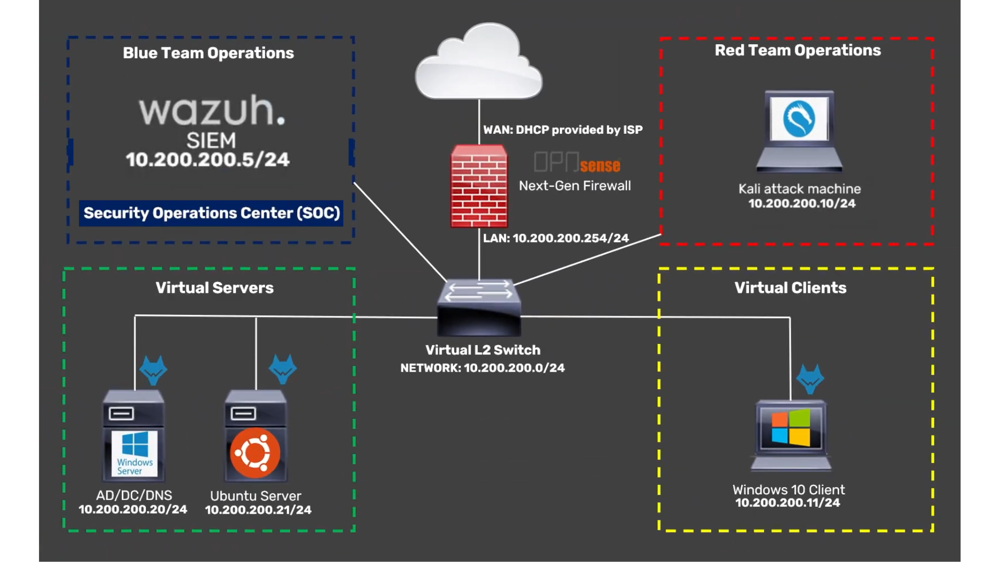

# 📡 Next Generation SIEM Stack: Architecture

## 🔍 Overview
The **Next Generation SIEM Stack** follows a **multi-layered defense approach**, combining **network and endpoint security mechanisms** to provide real-time threat detection and response. This architecture integrates **Wazuh SIEM, Suricata IDS/IPS, OPNsense Firewall, and VirusTotal API**, ensuring **network segmentation, intrusion detection, vulnerability assessment, and automated response**.

## 🏗️ System Design
The system is designed with **three core security layers**:

1. **Network Security Layer** – Monitors and filters traffic using **OPNsense Firewall** and **Suricata IDS/IPS**.
2. **Host-Level Security Layer** – Provides **log analysis, File Integrity Monitoring (FIM), vulnerability scanning**, and **SSH brute-force prevention** using **Wazuh SIEM**.
3. **Threat Intelligence Layer** – Uses **VirusTotal API and MITRE ATT&CK** framework for **malware detection and attack correlation**.

---

## 🔥 Network Segmentation & Security Policies
To enhance security, the architecture implements **network segmentation** with different security zones:

| **Zone**      | **Purpose**                                   | **Allowed Traffic**                |
|--------------|-------------------------------------------|----------------------------------|
| **LAN**      | Internal network for secure devices       | Outbound HTTPS, DNS, RDP, SIEM logs |
| **DMZ**      | Public-facing services (e.g., Web Apps)  | Limited HTTP/HTTPS, VPN        |
| **SOC**      | Security Operations Center (Wazuh SIEM)  | Full network access for threat monitoring |
| **Red Team** | Ethical hacking & security testing      | Isolated with controlled access |

## 🛡️ Security Components

### **1️⃣ OPNsense Firewall & Suricata IDS/IPS**
- **Traffic Filtering:** Controls inbound and outbound connections.
- **Intrusion Prevention:** Blocks malicious packets using **Suricata IPS**.
- **Web Filtering:** Enforces access control policies via **Squid Proxy**.

📌 **Key Features:**
✔️ Custom firewall rules for **role-based access control (RBAC)**.
✔️ GeoIP filtering to block traffic from high-risk countries.
✔️ Deep Packet Inspection (DPI) for encrypted traffic.

### **2️⃣ Wazuh SIEM & Endpoint Security**
- **Centralized Log Management** – Collects and analyzes logs from network & endpoints.
- **File Integrity Monitoring (FIM)** – Detects unauthorized file modifications.
- **Malware Detection** – Uses VirusTotal API for scanning suspicious files.

📌 **Key Features:**
✔️ **Host Intrusion Detection (HIDS)** with real-time alerts.
✔️ **MITRE ATT&CK Integration** for attack correlation.
✔️ **Automated Incident Response** to block threats dynamically.

<!-- 

--- -->

### **3️⃣ Threat Intelligence & Automated Response**
- **Vulnerability Scanning** – Detects outdated software & misconfigurations.
- **Brute-Force Protection** – Blocks repeated SSH login attempts.
- **Security Awareness Module** – Enforces cybersecurity best practices.

📌 **Key Features:**
✔️ **Threat Hunting Dashboards** with actionable insights.
✔️ **AI-Driven Anomaly Detection** for insider threats.
✔️ **Auto-Blocking of Malicious IPs** detected by Wazuh & Suricata.

<!-- 

--- -->

## 🔄 Incident Response Workflow
When a security event occurs, the **SIEM stack follows this structured workflow:**

1. **Event Detection** – Wazuh & Suricata detect anomalies in network traffic & logs.
2. **Alert Generation** – Suspicious activity is flagged in the **SIEM dashboard**.
3. **Threat Correlation** – Alerts are mapped to **MITRE ATT&CK tactics**.
4. **Automated Response** – Wazuh triggers firewall rules or quarantines infected files.
5. **Security Analysis** – SOC teams investigate using **SIEM dashboards**.
6. **Remediation & Reporting** – Threats are neutralized & logs are stored for compliance.

<!-- 

--- -->

## 🎯 Scalability & Future Enhancements
This architecture is **scalable** and can be **extended** to include:
- **Cloud SIEM (Elastic Stack, Azure Sentinel) for hybrid security monitoring**.
- **Machine Learning-based anomaly detection for insider threat detection**.
- **IoT Security Monitoring for connected devices & smart networks**.

🔹 This design ensures **proactive cybersecurity**, **real-time intrusion detection**, and **automated threat mitigation** for enhanced organizational security. 🚀
